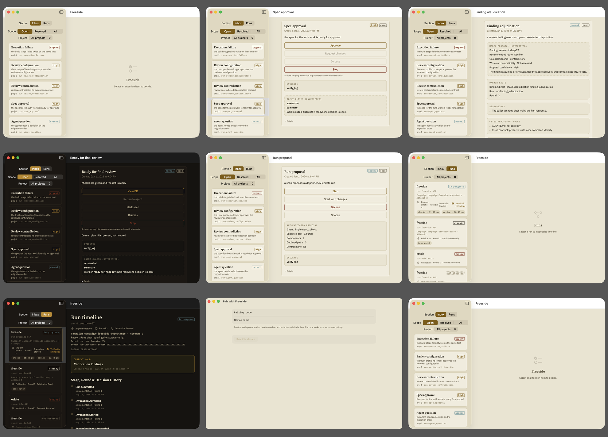
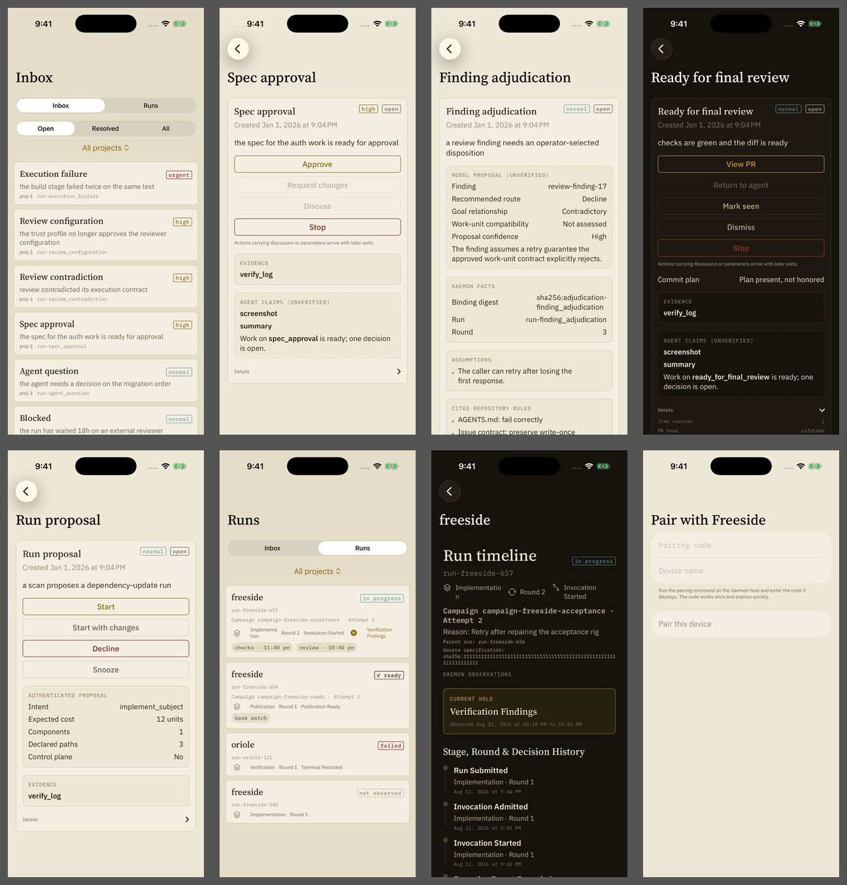
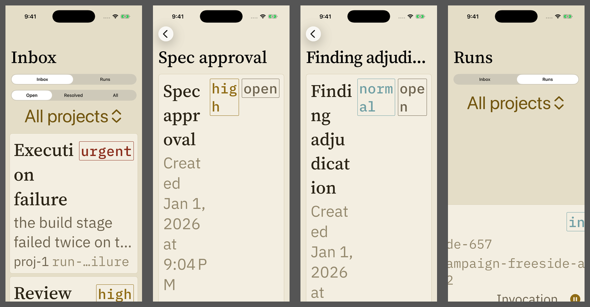

# Freeside UX Review: macOS and iOS

**Review target:** Freeside `main` at commit `0e81ee2e`  
**Review date:** August 25, 2026  
**Platforms inspected:** macOS at 960 × 640; iPhone 17 Pro simulator on iOS 26.5  
**States inspected:** pairing, inbox, multiple decision types, finding adjudication, run proposal, run list, run timeline, light appearance, dark appearance, and maximum accessibility text with Increase Contrast enabled

## Executive Summary

Freeside has a strong visual and conceptual foundation, but the current client is not ready for broad release. Its best qualities are unusually good: it treats trust, provenance, stale state, and decision safety as visible product concepts rather than backend details. The warm Freeside and dark Straylight palettes are distinctive, the run timeline is excellent, and the interface generally feels deliberate rather than assembled from stock controls.

The main weakness is that the product’s safety model is more mature than its decision UX. Freeside knows a great deal about what the operator needs to decide, but the interface often presents that knowledge as generic cards, technical labels, and a vertical inventory of actions. The result is visually polished but cognitively expensive.

Three changes should lead the next UX iteration:

1. **Make accessibility layouts and colors release-safe.** Maximum Dynamic Type currently breaks core screens, and several semantic colors fail Apple’s contrast guidance.
2. **Redesign decision cards around the recommended path.** Show the recommendation, rationale, uncertainty, and decisive facts before secondary actions and evidence. Remove actions the client cannot perform.
3. **Adopt platform-appropriate navigation.** Keep a sidebar-oriented model on macOS, but use a persistent tab bar and independent navigation stacks on iPhone.

My overall assessment:

| Dimension | Assessment | Summary |
| --- | --- | --- |
| Visual identity | **Strong** | Distinctive, coherent, attractive in light and dark appearances |
| Trust and safety communication | **Strong** | Provenance, stale-state protection, claims, and disabled unsafe actions are treated seriously |
| macOS native fit | **Good but incomplete** | Native SwiftUI foundation, but missing several desktop conventions and efficiencies |
| iOS native fit | **Mixed** | Native controls, but desktop information architecture is being collapsed onto a phone |
| Signal-to-noise | **Mixed to weak** | Important state is visible, but IDs, generic badges, disabled actions, and undifferentiated sections dilute it |
| Ease of use | **Mixed** | Simple top-level model, but decision completion, navigation, and filtering require avoidable work |
| Understandability | **Mixed** | Labels are generally plain, but domain concepts and action consequences are insufficiently explained |
| Accessibility | **Release blocker** | Severe Dynamic Type reflow failures and multiple contrast failures |
| Use of graphics | **Uneven** | Excellent run timeline; most decision surfaces remain text-and-border interfaces |
| Product maturity | **Promising foundation** | Core architecture is ahead of the final presentation layer |

## Review Scope and Limitations

This review combined rendered inspection with a source-level UX audit.

The rendered review used Freeside’s deterministic mock data, not personal or production data. The iOS accessibility pass used the largest available accessibility text category with Increase Contrast enabled.

The review did not exercise:

- A live daemon or real repository
- A physical iPhone
- Push notifications
- VoiceOver end to end
- Switch Control
- Full Keyboard Access end to end
- Actual destructive decisions
- The interactive macOS menu-bar popover
- Network latency and recovery over a real Tailscale connection

Those should be separate verification passes. The findings below distinguish rendered observations from source-informed risks.

## Rendered Reference

### macOS states



The matrix includes the empty inbox detail, spec approval, finding adjudication, ready-for-final-review dark mode, run proposal, run list, active run timeline, pairing, and default application window.

### iOS states



The iOS sequence uses the same fixture states. It demonstrates how the shared `NavigationSplitView` collapses into phone navigation.

### Accessibility stress test



At the largest accessibility text size, card headers, chips, run rows, and filters cease to provide a usable layout. Words wrap character-by-character, labels clip, and the useful content area becomes extremely narrow.

## What Freeside Does Well

### 1. It Has a Real Design Language

Freeside does not look like an unstyled developer tool. The serif titles, Plex Sans interface text, monospaced evidence register, parchment-like grounds, restrained borders, and muted semantic colors establish a coherent identity.

The three-font hierarchy has a clear rationale:

- Serif identifies screens and important subjects.
- Sans supports reading and controls.
- Mono identifies state, provenance, IDs, and evidence.

That is more disciplined than many applications that use several faces decoratively. The distinction between narrative content and machine-authenticated content is especially appropriate for an agent control plane.

### 2. Color Semantics Are Conceptually Excellent

Freeside makes several thoughtful choices:

- Accent means attention or a recommended path, not success.
- Wax means failure, revocation, or loss.
- Water means active or informational-live.
- Successful completion is quiet and neutral.
- Status is reinforced by text, borders, glyphs, and dashed states.

This avoids the common dashboard problem where every healthy state is bright green and every screen becomes a Christmas tree. It also aligns with the product goal of surfacing exceptions instead of continually celebrating normal operation.

The conceptual color model should remain. The accessibility implementation needs repair, not replacement.

### 3. Trust and Provenance Are Visible

The decision card visibly separates:

- Daemon facts
- Evidence
- Agent claims
- Unverified model proposals
- Binding details

The dashed treatment for agent claims is subtle but meaningful. “Agent claims (unverified)” is direct wording, and the design does not imply that a fluent summary is authoritative evidence.

This is one of the application’s most important strengths. The user can see not only an assertion, but what class of actor made it.

### 4. Stale and Unreachable State Is Handled Responsibly

The freshness banner is a strong product pattern:

- Cached content stays readable.
- Actions are disabled.
- Unreachable, sync-failing, and revoked states are distinguished.
- The warning is inline rather than a modal alert.
- The wording tells the operator both what happened and what changed.

This is consistent with Apple’s guidance to use contextual indicators instead of startup alerts for conditions such as unavailable services. See Apple’s [Alerts guidance](https://developer.apple.com/design/human-interface-guidelines/alerts).

### 5. The Run Timeline Is the Best Surface

The run timeline successfully turns technical process state into a comprehensible visual history:

- A chronological rail establishes sequence.
- The current hold is visually isolated.
- Stage, round, and invocation context are grouped.
- Live, completed, failed, and observation-gap states combine text and glyphs.
- The page scales from a wide macOS detail pane to iPhone surprisingly well.

This should be the model for the rest of Freeside: a graphic structure first, then progressively more technical detail.

### 6. Empty, Loading, and Error States Are Present

The app uses native `ContentUnavailableView` and `ProgressView` states rather than displaying blank panels or stale controls without explanation.

The empty detail messages are short and clear:

- “Select an attention item to decide.”
- “Select a run to inspect its timeline.”

They can become more useful, but they already provide orientation.

### 7. Pairing Is Appropriately Small

The pairing screen asks for only pairing code and device name. It explains that the code is single-use and short-lived. The interface uses a native form and does not burden the operator with credential implementation details.

### 8. Native SwiftUI Foundations Are Sound

Freeside uses standard platform structures such as `NavigationSplitView`, `NavigationStack`, `List`, `Form`, `Picker`, `MenuBarExtra`, `ContentUnavailableView`, and native sheets and toolbars. That foundation preserves accessibility semantics and gives the application a credible platform feel even when its content styling is heavily customized.

## Priority Definitions

| Priority | Meaning |
| --- | --- |
| **P0** | Release blocker. A core workflow is inaccessible, unreadable, unsafe, or unusable for a supported configuration. |
| **P1** | High impact. Causes decision errors, significant friction, or repeated misunderstanding in primary workflows. |
| **P2** | Medium impact. Noticeably reduces efficiency, discoverability, or platform fit. |
| **P3** | Polish. Worth addressing after the underlying hierarchy and accessibility are sound. |

## Weakness Catalog

### P0-1: Dynamic Type Breaks Core iOS Layouts

**Platforms:** iOS  
**Affected surfaces:** inbox, decision headers, chips, run list, filters

Maximum accessibility text produces character-by-character wrapping, clipped titles, oversized filter controls, horizontally lost run data, and almost unusable card headers.

The primary causes are fixed horizontal compositions that do not change at accessibility sizes:

- Title, priority, posture, and status share one horizontal row.
- State chips permit their short words to wrap.
- Run rows place several stage and milestone labels into a single horizontal row.
- `LabeledContent` assumes enough horizontal room for both label and value.
- Project menus become disproportionately large without the surrounding layout changing.

Apple requires layouts to adapt at all Dynamic Type sizes and recommends preserving useful content instead of allowing extensive truncation. See Apple’s [Typography guidance](https://developer.apple.com/design/human-interface-guidelines/typography) and [Accessibility guidance](https://developer.apple.com/design/human-interface-guidelines/accessibility).

#### Potential solutions

**Solution A: Cap Dynamic Type inside complex cards.**

This is the smallest engineering change but the wrong product decision. It would make the layout less broken by denying low-vision users the text size they selected.

**Solution B: Reflow specific components at accessibility sizes.**

Use responsive layouts and vertical alternatives:

- Change card headers from horizontal to vertical.
- Move badges to a separate wrapping row.
- Make chip labels single-line and non-compressible.
- Replace multi-column labeled content with stacked label/value blocks.
- Change run metadata into vertically stacked rows.
- Allow action buttons to grow vertically without clipping.

**Solution C: Create an accessibility-first card composition.**

At accessibility sizes, use a deliberately simplified sequence: item title, priority and status, ask, recommended action, decisive facts, secondary actions, then evidence and details.

#### Recommendation

Implement **Solution B plus a simplified accessibility composition from Solution C**. Do not cap text size. Every screen should be captured across the full standard and accessibility size matrix before release.

### P0-2: Several Semantic Colors Fail Contrast Requirements

**Platforms:** macOS and iOS  
**Affected surfaces:** state chips, metadata, disabled states, destructive actions, run statuses, dark appearance

Approximate WCAG contrast ratios from the committed color tokens:

| Color | Light ground | Light card | Dark ground | Dark card |
| --- | ---: | ---: | ---: | ---: |
| Ink | 12.44 | 13.26 | 14.54 | 13.72 |
| Dim ink | 4.72 | 5.03 | 7.90 | 7.46 |
| Faint ink | **2.80** | **2.99** | **4.03** | **3.80** |
| Accent | **3.97** | **4.23** | 6.55 | 6.18 |
| Wax | 6.88 | 7.33 | **2.58** | **2.43** |
| Water | **2.40** | **2.55** | 4.55 | **4.29** |

Apple uses 4.5:1 as guidance for ordinary small text and 3:1 for sufficiently large or bold text. Thin borders and tiny monospaced chips are particularly sensitive. Apple also recommends explicit Increased Contrast variants for custom colors. See [Color](https://developer.apple.com/design/human-interface-guidelines/color) and [Accessibility](https://developer.apple.com/design/human-interface-guidelines/accessibility).

The most visible failures are light-mode normal and in-progress chips, light-mode faint metadata, light-mode accent chip text, dark-mode destructive and failed text, and dark-mode faint metadata on cards.

Increase Contrast does not materially repair these because the custom adaptive color implementation changes only for light versus dark appearance.

#### Potential solutions

**Solution A: Replace semantic colors with system colors.**

This is the easiest way to inherit light, dark, and contrast variants. It would improve native fit but substantially reduce Freeside’s visual identity.

**Solution B: Keep the palette and add accessible variants.**

Define each semantic color with light, dark, Light Increased Contrast, and Dark Increased Contrast variants. Validate text colors to at least 4.5:1 against every background where they appear. Validate important borders and non-text indicators to at least 3:1.

**Solution C: Separate decorative and text variants.**

A lower-contrast water or accent can remain in large washes, while text and borders use stronger semantic variants such as `waterText`, `waterWash`, and `waterBorder`.

#### Recommendation

Use **Solutions B and C**. Preserve the Freeside identity, but separate text, wash, and border colors and support Increased Contrast. Use system red for destructive control semantics unless an accessible wax variant can match its clarity in both appearances.

### P1-1: Decision Cards Put Action Inventory Ahead of Understanding

**Platforms:** macOS and iOS

A typical card currently presents a repeated title and timestamp, a one-sentence reason, every action as a full-width button, a note about unsupported actions, facts, evidence, agent claims, and finally details.

This makes the first viewport look like a command panel, not a self-contained decision explanation. The problem is clearest in “Ready for final review,” where five actions appear before the change summary, verification result, review history, or evidence.

#### Potential solutions

**Solution A:** Move the existing action stack below all context. This is easy, but it risks forcing excessive scrolling before any action.

**Solution B:** Create a compact decision header with the decision needed, recommended outcome, why it is recommended, decisive facts, uncertainty, and recommended action.

**Solution C:** Use a sticky action footer. On iPhone, the recommended action can remain available in a bottom safe-area inset while the user reviews the card. On macOS, actions can live in a trailing or bottom action area.

#### Recommendation

Use **Solution B**, plus a restrained version of **Solution C** on long cards. The user must be able to review the recommendation’s basis before executing it.

### P1-2: Unsupported Actions Are Rendered as Disabled Product Features

Several cards display disabled actions followed by “Actions carrying discussion or parameters arrive with later units.” This is implementation-roadmap language, not operator-facing product language.

Disabled buttons look like a temporary state or permission problem. The user cannot tell whether an action is unsupported, unavailable, or awaiting validation. They also add noise before evidence.

#### Recommendation

Hide optional actions the client cannot perform. If a requested action is necessary for a faithful decision, show an explicit capability-mismatch state rather than a partial card. Remove roadmap wording from the production UI.

### P1-3: iPhone Uses a Sidebar-Derived Top-Level Navigation Model

Inbox and Runs are top-level destinations, but they are presented through a segmented control inside the collapsed split-view sidebar. Once a user opens a decision or timeline, the top-level switch disappears.

Apple describes tab bars as the standard way to keep top-level destinations visible while preserving each section’s navigation state. Apple also recommends a tab bar when a sidebar consumes too much space. See [Tab bars](https://developer.apple.com/design/human-interface-guidelines/tab-bars) and [Sidebars](https://developer.apple.com/design/human-interface-guidelines/sidebars).

#### Recommendation

Use a persistent tab model with independent navigation stacks for Inbox and Runs. Where deployment targets allow it, use an adaptable tab/sidebar configuration that becomes a sidebar in regular width.

### P1-4: The Recommendation Can Be Several Screens Away from Its Action

The finding-adjudication card correctly presents recommendation, rationale, facts, assumptions, rules, alternatives, and questions. However, the action accepting the recommended route comes after all of that content.

Create a recommendation card near the top:

```text
RECOMMENDED ROUTE

Decline this finding

The finding conflicts with the approved work-unit contract.
Confidence: High

[Accept recommendation]
[Review alternatives]
```

Keep assumptions, citations, and gating questions immediately below. Color should emphasize the recommended path, but also use an icon and explicit “Recommended” label so color is not the only signal.

### P1-5: Card Types Are Still Too Generic

Eleven card types use essentially the same layout despite asking the user to perform very different cognitive tasks.

Examples:

- Execution failure should lead with the failed stage and likely cause.
- Review diminishing returns should visualize new versus recurring findings by round.
- Review dispute should show both positions side by side.
- Ready for final review should show a readiness checklist and change summary.
- Blocked should emphasize duration, dependency, and who or what can clear it.
- System health should show impaired capability and recommended recovery.
- Spec approval should show intent, unresolved questions, and change from prior review.

#### Recommendation

Implement card-specific composition in this order: ready for final review, execution failure, spec approval, review diminishing returns, review dispute, system health, and blocked. Reuse composable fact, recommendation, evidence, comparison, and timeline modules rather than creating unrelated layouts.

### P1-6: Successful Decisions May Lose Their Confirmation Context

When an action resolves an item in the default Open scope, the row can disappear and selection can return to the empty detail state. That risks replacing the decision card before the operator absorbs the “Decision applied” banner.

#### Recommendation

After a successful resolving action, show a global nonmodal confirmation, keep it visible long enough to understand, select the next highest-priority item, and offer “View resolved item” where useful. Preserve error and retry state if the response is uncertain.

### P1-7: Evidence Loading Can Be Visually Silent

In the rendered spec-approval fixture, the screenshot claim displayed its label but no image, loading state, error, or non-image explanation, even after a seven-second settle.

Use explicit states for loading, image available, non-image file, unavailable, and oversized evidence. Make images tappable into a native preview. Preserve the digest in Details rather than using it as the main visible label.

### P1-8: Selection Is Communicated Primarily Through Border Color

The selected sidebar row changes from the rule border to an accent border. Shape, fill, and layout remain the same.

Add a non-color cue such as a subtle selected fill, leading selection bar, check glyph, or adapted system selection background. The selected state should remain visible with Differentiate Without Color enabled.

### P1-9: Destructive Actions Lack Native Destructive Semantics

Stop and Decline use a custom wax-colored style, but the buttons are not assigned a native destructive role. There is also no visible confirmation path for potentially consequential actions.

Apply native destructive roles where the action truly stops or discards work. Confirm unexpected, irreversible actions. State the consequence directly, such as “Stop this run?” Keep Cancel as the safe default. See Apple’s [Buttons guidance](https://developer.apple.com/design/human-interface-guidelines/buttons).

### P1-10: Manual and Foreground Refresh Are Missing

The heartbeat eventually detects missed changes, but there is no pull to refresh, macOS refresh command, Command-R shortcut, last-updated affordance, or immediate foreground refresh.

Add native pull to refresh on iOS, a refresh toolbar action and Command-R on macOS, and immediate refresh on foreground activation. Manual refresh should be a recovery and confidence affordance, not something normal operation depends upon.

## P2 Findings

### P2-1: Titles Are Duplicated

On iPhone, “Spec approval” appears as both the large navigation title and the card title. On iOS, let the navigation title provide orientation and begin the card with the ask, priority, and timing. On macOS, keep window chrome generic unless the item title materially aids window switching.

### P2-2: Normal and Open Badges Add Noise

Most items show `normal` and `open`, even when the user is already in the Open inbox. Always show urgent and high priority. Consider omitting normal priority and Open status in the Open scope. Always show unusual lifecycle states such as superseded, expired, revoked, or degraded.

### P2-3: Machine IDs Compete with Human Meaning

Values such as `proj-1`, run IDs, campaign IDs, and digests remain in the scanning layer. Show the human project name, work-unit title, and relative activity time. Move complete identifiers into Details, context menus, copy affordances, or concise macOS tooltips.

### P2-4: Absolute Creation Time Is Less Useful Than Decision Urgency

Lead with operational time such as “Waiting 18 minutes,” “Due in 2 hours,” or “Blocked for 18 hours.” Put the exact timestamp in a tooltip on macOS and Details on both platforms.

### P2-5: Inbox Filters Lack Counts and Priority Summary

Use quiet counts such as Open 7, Resolved 3, and All 10. Add a prominent count only for exceptional work, for example “1 urgent.” Avoid badge inflation.

### P2-6: Search Is Absent

Add native search across item title, project, work-unit title, run reference, and item type. Do not search full evidence or claim text in the first implementation because that creates disproportionate trust, privacy, and indexing questions.

### P2-7: macOS Does Not Use Its Width Efficiently

Decision cards cap at a narrow width, leaving large unused margins while long cards scroll. Use an adaptive two-column composition for complex cards: main content for ask, recommendation, summary, and actions; secondary content for facts, evidence, and bindings.

### P2-8: Run Rows Squeeze Too Many Facts Into One Line

Stage, round, milestone, hold, and schedules compete horizontally. Use two rows for stage and hold, then place watches in a wrapping chip row.

### P2-9: Pairing Does Not Optimize Code Entry

Use numeric keypad input where codes are numeric, one-time-code semantics, grouped formatting, paste support, and a prefilled human-readable device name. Show the daemon host or deployment being paired and explain where the device name appears.

### P2-10: macOS Lacks Keyboard Efficiency

Recommended commands include Command-1 for Inbox, Command-2 for Runs, Command-F for search, Command-R for refresh, Up/Down or J/K to move through items, Return for a safe validated primary action, Space to expand details, and Escape to cancel. Include equivalent app-menu commands so shortcuts are discoverable.

### P2-11: The Menu-Bar Utility Needs a Route Back Into the App

Add “Open Freeside” and “Show Inbox” near the top of the menu. Include an urgent-item count only when exceptional attention exists. Keep daemon lifecycle controls in a separate section.

### P2-12: Help Is Almost Entirely Absent

Use visible copy for essential concepts, short macOS tooltips for compact controls and state terms, and info sheets or TipKit for infrequent teachable concepts on iOS. Never hide a decision consequence in a tooltip. See Apple’s [Offering help](https://developer.apple.com/design/human-interface-guidelines/offering-help).

## P3 Findings

### P3-1: The Empty macOS Detail Pane Is Too Passive

Show a quiet operational summary with open-decision count, highest-priority item, active runs, and any daemon issue. Keep it visually restrained.

### P3-2: Button Styling Could Emphasize the Recommended Path More Clearly

Use one filled or higher-prominence primary button per card. Secondary actions can remain bordered or move into a menu. Destructive actions retain text and semantic role but should not compete visually with the recommendation.

### P3-3: The Interface Could Use More Familiar SF Symbols

Useful combinations include Approve with `checkmark`, Request changes with `arrow.uturn.backward`, Discuss with `bubble.left.and.bubble.right`, Retry with `arrow.clockwise`, Stop with `stop`, View PR with `arrow.up.right.square`, Snooze with `clock`, and Evidence with `doc.text.magnifyingglass`.

Icons should supplement concise labels, not replace them. See Apple’s [Icons](https://developer.apple.com/design/human-interface-guidelines/icons) and [SF Symbols](https://developer.apple.com/design/human-interface-guidelines/sf-symbols).

## Apple Native UX Assessment

### Navigation

#### macOS

The split view and collapsible sidebar are native. Weaknesses include top-level destinations presented as segmented controls instead of source-list destinations, filters consuming substantial sidebar space, no toolbar search or refresh, no obvious route from the menu-bar extra into the window, and no explicit keyboard-navigation layer.

#### iOS

Native navigation components are used, but the structure is inherited from the desktop split view. Inbox and Runs should be persistent top-level destinations, not a segmented control that disappears on drill-down.

### Controls

Pickers, forms, lists, sheets, and toolbars are native. Custom button styling preserves recognizable shapes. Weaknesses include absent native destructive roles, too many equally prominent buttons, disabled controls representing unimplemented features, absent default-action keyboard semantics on macOS, and selection customized away from familiar system treatment.

### Materials and Chrome

Freeside deliberately uses solid custom grounds rather than leaning into Apple’s current navigation materials. That is not inherently wrong. The recommended balance is to let the system own navigation bars, tab bars, toolbars, sheets, focus, and menus while applying Freeside’s palette to content, cards, state washes, and selective emphasis. See Apple’s [Materials guidance](https://developer.apple.com/design/human-interface-guidelines/materials).

### Typography

The typography is distinctive and generally legible at default size. The implementation uses relative text styles, which is the correct technical direction. The layout does not adapt when those styles grow, faint mono metadata is too low contrast, and long technical strings need explicit line-breaking and copy behavior.

### Color

Keep neutral success, accent for attention, wax for failure, water for live state, and text-and-glyph reinforcement. Add contrast-safe text variants, Increased Contrast variants, non-color selected-state cues, stronger recommended-action prominence, and less color for normal/default states.

## Recommended Information Architecture

### iPhone

Use two persistent tabs:

```text
┌──────────────────────────────┐
│ Inbox                        │
│                              │
│ [Open 7] [Resolved 3]        │
│ All projects                 │
│                              │
│ 1 urgent                     │
│ ┌──────────────────────────┐ │
│ │ Execution failure       !│ │
│ │ Build failed in verify   │ │
│ │ freeside · waiting 12m   │ │
│ └──────────────────────────┘ │
│                              │
│  Inbox              Runs     │
└──────────────────────────────┘
```

Each tab should preserve its own navigation state.

### Decision Detail

The target card should be organized around a decision, not the data schema:

```text
< Inbox                       …

SPEC APPROVAL
High priority · waiting 12 min

Decision needed

Approve the authentication work specification.

RECOMMENDED
Approve

Why
The plan stays within the approved auth surface.
Two implementation questions are resolved.
One question remains open.

[ Approve ]

[Review changes]   [More…]

Key facts
• 3 declared paths
• No control-plane change
• Expected cost: 12 units

Agent summary, unverified
…

Evidence
…

Technical details
…
```

### macOS

Retain the split view, but use desktop space:

```text
┌───────────────┬─────────────────────────┬──────────────────┐
│ Inbox         │ Decision                │ Evidence/Facts   │
│ Runs          │                         │                  │
│               │ Recommended action      │ Verification     │
│ Open 7        │ Rationale               │ Bindings         │
│ Resolved 3    │ Primary action          │ Attachments      │
│               │ Alternatives            │                  │
│ Item list     │                         │                  │
└───────────────┴─────────────────────────┴──────────────────┘
```

The third column should appear only when enough width exists or when the user opens an inspector.

## Recommended Use of Graphics

Freeside should use graphics to compress process information, not decorate cards.

| Card type | Recommended graphic | Why it helps |
| --- | --- | --- |
| Execution failure | Stage rail with failed stage highlighted | Shows where failure occurred without reading logs |
| Review diminishing returns | Small per-round bar or line chart | Makes declining review yield immediately visible |
| Review dispute | Two-column position comparison | Preserves dissent and prevents one side from reading as authority |
| Finding adjudication | Compact route map | Connects goal relationship and compatibility to the recommendation |
| Ready for final review | Verification checklist and review-yield summary | Shows why the item is ready before navigating to the PR |
| Run proposal | Scope footprint with cost, components, paths, and control-plane risk | Turns abstract counts into a quick risk impression |
| System health | Capability diagram showing what is impaired | Connects diagnosis to operator impact |
| Blocked | Duration and dependency card | Makes owner, wait cause, and elapsed time obvious |

The run timeline already demonstrates the correct standard: every graphic has semantic value and adjacent text.

## Prioritized Implementation Roadmap

### Phase 1: Release Blockers

| Order | Work | Priority | Size |
| ---: | --- | --- | --- |
| 1 | Responsive Dynamic Type layouts for all primary screens | P0 | Large |
| 2 | Accessible semantic color variants, including Increased Contrast | P0 | Medium |
| 3 | Accessibility test matrix and screenshot regression coverage | P0 | Medium |

### Phase 2: Decision Quality

| Order | Work | Priority | Size |
| ---: | --- | --- | --- |
| 4 | Recommendation-led decision-card shell | P1 | Large |
| 5 | Hide unsupported actions and define capability-mismatch state | P1 | Medium |
| 6 | Sticky or persistent primary action for long cards | P1 | Medium |
| 7 | Native destructive roles and confirmation policy | P1 | Small to medium |
| 8 | Durable success feedback and automatic next-item flow | P1 | Medium |
| 9 | Explicit attachment loading, preview, and failure states | P1 | Medium |

### Phase 3: Platform Fit

| Order | Work | Priority | Size |
| ---: | --- | --- | --- |
| 10 | iPhone tab navigation with independent stacks | P1 | Medium |
| 11 | macOS toolbar, search, refresh, and keyboard commands | P2 | Medium |
| 12 | Menu-bar “Open Freeside” and urgent-item route | P2 | Small |
| 13 | Non-color selection treatment | P1 | Small |
| 14 | Foreground and manual refresh | P1 | Medium |

### Phase 4: Signal-to-Noise

| Order | Work | Priority | Size |
| ---: | --- | --- | --- |
| 15 | Hide normal/open default badges | P2 | Small |
| 16 | Relative waiting and deadline language | P2 | Small |
| 17 | Filter counts and urgent summary | P2 | Small |
| 18 | Move technical identifiers into Details and copy menus | P2 | Medium |
| 19 | Search | P2 | Medium |
| 20 | Adaptive two-column macOS detail | P2 | Medium |

### Phase 5: Card-Specific Comprehension

| Order | Work | Priority | Size |
| ---: | --- | --- | --- |
| 21 | Ready-for-final-review composition | P1 | Medium |
| 22 | Execution-failure composition | P1 | Medium |
| 23 | Spec-approval composition | P1 | Medium |
| 24 | Review-yield graphic | P2 | Medium |
| 25 | Review-dispute comparison | P2 | Medium |
| 26 | System-health and blocked compositions | P2 | Medium |

## Verification Criteria

### Accessibility

- Every primary screen remains operable at every Dynamic Type size.
- No badge wraps character-by-character.
- No essential value is horizontally clipped.
- Text meets 4.5:1 contrast unless it qualifies as large or sufficiently bold.
- Important controls and indicators meet 3:1 non-text contrast.
- Increased Contrast visibly strengthens custom colors.
- Selected state remains visible with Differentiate Without Color.
- VoiceOver reads card content in this order: type, urgency, ask, recommendation, facts, actions, evidence, details.
- Decorative graphics are hidden from VoiceOver; meaningful graphics have concise summaries.

### Decision quality

- Every actionable card states the decision in one sentence.
- Every recommendation explains why it is recommended.
- The primary action is visible in the first standard phone viewport or persistently available.
- No unsupported action is rendered as a generic disabled button.
- Destructive consequences are explicit.
- A successful decision produces visible feedback before the next item replaces it.
- An uncertain submission visibly preserves Retry.

### Navigation

- Inbox and Runs remain reachable from any iPhone detail.
- Each top-level section preserves its own navigation state.
- macOS supports keyboard movement through the inbox.
- Search and refresh use native platform placement.
- Closing the macOS window does not strand the user in a menu-bar utility with no route back.

### Evidence

- Every attachment has a visible loading, available, unsupported, oversized, or unavailable state.
- Image evidence can be expanded.
- Technical digests are copyable.
- Agent-authored summaries and screenshots remain visibly labeled as claims.

### Product metrics

Freeside’s own attention telemetry can validate the redesign:

- Median time from item open to informed decision
- Drill-down rate by card type
- Backtracking between card and list
- Rate of opening Details before acting
- Rate of choosing a nonrecommended action
- Decision reversals or later comprehension defects
- Time spent on unavailable or disabled actions
- Review-ready items later returned for missing context
- Accessibility defects found in audit runs

A lower drill-down rate is not automatically better. It is positive only when sampled comprehension remains strong.

## Final Recommendation

Freeside should preserve its identity. The warm palette, typographic register, quiet success semantics, evidence labeling, and timeline design are product advantages, not styling experiments to discard.

The next UX pass should focus on **recomposition rather than restyling**:

1. Repair accessibility reflow and contrast.
2. Put the recommendation and its reasons at the center of every decision.
3. Remove unsupported and default-state noise.
4. Give iPhone a persistent tab-based structure.
5. Use card-specific graphics to compress process state.
6. Add desktop efficiency through search, refresh, tooltips, menus, and keyboard commands.

The strongest possible Freeside client is not a dense control-plane dashboard. It is a quiet, trusted decision instrument: it should tell the operator what needs judgment, recommend a path, explain why, make uncertainty visible, and keep everything else one deliberate layer lower.
